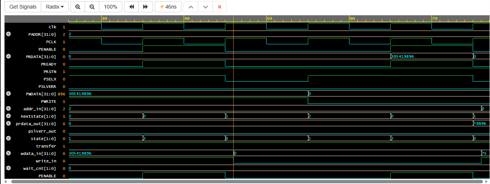
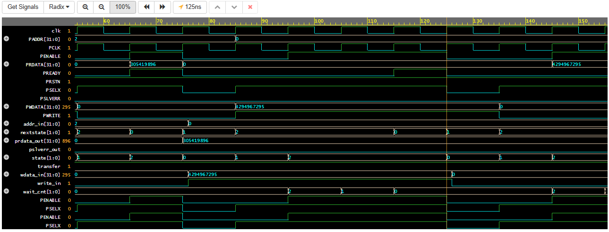
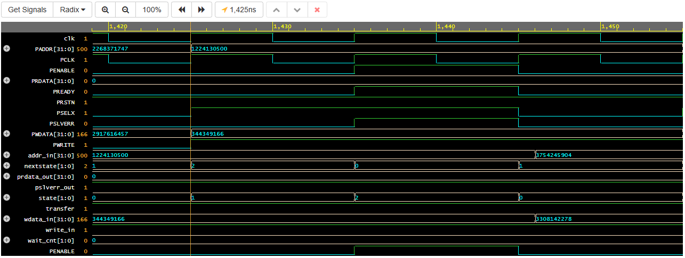
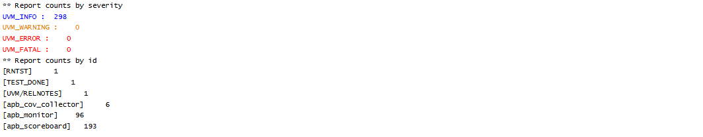

# APB3 RTL & UVM Verification

A SystemVerilog UVM verification environment for a hand-designed AMBA APB3 
Master-Slave interface, featuring wait-state handling, error response generation, 
and protocol-compliance checking via SystemVerilog Assertions.

---

## Overview

This project implements and verifies an APB3-compatible Master-Slave bus interface 
from scratch — both the RTL design and a full class-based UVM testbench. It covers 
the complete verification flow: directed and constrained-random stimulus, a 
reference-model scoreboard, functional coverage with cross-coverage, and SVA-based 
protocol checks.

| | |
|---|---|
| **HDL** | Verilog (RTL), SystemVerilog + UVM 1.2 (testbench) |
| **Simulator** | Synopsys VCS |
| **Protocol** | AMBA APB3 |

---

**Repository Structure**

- `rtl/`
  - `apb_master.v`
  - `apb_slave.v`
- `tb/`
  - `apb_if.sv`
  - `apb_txn.sv`
  - `apb_sequencer.sv`
  - `sequences/`
    - `apb_base_sequence.sv`
    - `corner_cases.sv`
    - `random_test.sv`
    - `random_without_cons.sv`
    - `random_reads.sv`
  - `apb_driver.sv`
  - `apb_monitor.sv`
  - `apb_cov_collector.sv`
  - `apb_scoreboard.sv`
  - `apb_agent.sv`
  - `apb_env.sv`
  - `apb_test.sv`
  - `tb_top.sv`
- `docs/`
  - `logs/`
    - `full_regression_log.txt`
    - `coverage_report.txt`
  - `waveforms/`
    - `write_read_match.png`
    - `wait_state_2cycle.png`
    - `pslverr_error_response.png`
    - `assertion_clean_pass.png`

---   

## RTL Design

### APB Master (`rtl/apb_master.v`)

A 3-state Moore FSM (`IDLE → SETUP → ACCESS`) that converts a simple local 
request interface (`transfer`, `write_in`, `addr_in`, `wdata_in`) into the APB3 
bus protocol.

- **Combinational control outputs** — `PSELX` and `PENABLE` are driven directly 
  from FSM state (`PSELX = (state != IDLE)`, `PENABLE = (state == ACCESS)`), 
  eliminating any registered-output lag relative to the state transition.
- **Address/data/control latching** — `PADDR`, `PWDATA`, `PWRITE` are captured 
  once, at the `IDLE → SETUP` transition, and held stable for the full transfer.
- **Response capture** — on `PREADY` during `ACCESS`, the master registers 
  `PRDATA` into `prdata_out` (for reads) and `PSLVERR` into `pslverr_out`.

### APB Slave (`rtl/apb_slave.v`)

A 256-word memory-mapped slave with:

- **Wait-state insertion** — any access whose address has a lower nibble of 
  `0x0` incurs 2 wait-states (`wait_cnt` loaded to `2`, decremented each ACCESS 
  cycle until `PREADY` asserts), modeling realistic peripheral latency.
- **Address-range checking** — `addr_valid = (PADDR < MEM_DEPTH)`. An 
  out-of-range access sets `addr_err`, which combinationally drives 
  `PSLVERR = PREADY && addr_err`, and the write is suppressed rather than 
  corrupting adjacent memory.

---

## Verification Environment

Built as a standard layered UVM agent around the DUT pair, driven through a 
single `apb_if` interface with separate driver/monitor clocking blocks.

| Component | Role |
|---|---|
| `apb_txn` | Transaction: randomizable stimulus fields + observed response fields |
| `apb_sequencer` / sequences | Generate directed, corner-case, and constrained-random stimulus |
| `apb_driver` | Drives `transfer`/`write_in`/`addr_in`/`wdata_in`; blocks on `PREADY` to correctly pace wait-states |
| `apb_monitor` | Passively reconstructs completed transactions on `PSELX && PENABLE && PREADY`, with edge-detection to avoid re-capturing a still-active transfer |
| `apb_scoreboard` | Independent memory-array reference model; checks write-then-read data correctness and verifies `PSLVERR` against an independently computed expected-error condition |
| `apb_cov_collector` | `uvm_subscriber`-based functional coverage: write/read ratio, data value bins, wait-state occurrence, and cross-coverage against write/error |
| `tb_top` | DUT instantiation, SVA protocol checks, reset generation, test invocation |

### Test Sequences

- **`apb_base_sequence`** — basic single write/read sanity check
- **`corner_cases`** — boundary addresses (`0x00`, `0xFF`) with boundary data (`0x00000000`, `0xFFFFFFFF`)
- **`random_test`** — constrained-random writes, address-space and wait-state-biased
- **`random_without_cons`** — fully unconstrained random transfers, including out-of-range addresses, to exercise `PSLVERR`
- **`random_reads`** — constrained-random reads

### Functional Coverage

| Coverpoint / Cross | What it measures |
|---|---|
| `cw` | Write vs. read transaction mix |
| `cwd` | Write data value classes (all-zeros / all-ones / mid-range) |
| `cerr` | Valid vs. out-of-range address access |
| `cwait` | Wait-state vs. zero-wait-state address |
| `cww` (cross) | All four combinations of write/read × wait-state |
| `cew` (cross) | All four combinations of write/read × valid/error address |

**Result: `[FILL IN FROM coverage_report.txt]`% overall functional coverage**, 
with 100% on the `cww` and `cew` crosses — confirming every meaningful 
read/write × wait-state × error-response combination was exercised.

### SystemVerilog Assertions

Two protocol-compliance properties, checked every clock cycle against the raw 
interface signals (not through the clocking block, to avoid sampling skew):

```systemverilog
// A transfer must spend exactly one cycle in SETUP before ACCESS
(PSELX && !PENABLE) |=> (PSELX && PENABLE)

// PENABLE must never assert without PSELX
PENABLE |-> PSELX
```

---

## Results
| Severity | Count |
|---|---|
| UVM_INFO | 298 |
| UVM_WARNING | 0 |
| UVM_ERROR | 0 |
| UVM_FATAL | 0 |
```
[apb_monitor] : 96 transactions captured
[apb_scoreboard] : 193 scoreboard events (writes + read checks)


- **96 APB transfers** verified across directed, corner-case, and constrained/
  unconstrained random sequences
- **Zero scoreboard mismatches** — every read-after-write returned correct data
- **Zero PSLVERR mismatches** — error response matched the independently 
  computed expected-error condition on every transaction
- **Zero assertion failures** — both protocol-timing properties held for the 
  entire regression
- **100% functional coverage** on write/read, data-value, wait-state, and both 
  cross-coverage bins

See [`docs/logs/full_regression_log.txt`](docs/logs/full_regression_log.txt) 
for the complete trace and [`docs/logs/coverage_report.txt`](docs/logs/coverage_report.txt) 
for the final coverage summary.

---

## Waveforms

| | |
|---|---|
|  | Write-then-read to the same address, confirming data integrity |
|  | `wait_cnt` counting 2→1→0, `PREADY` correctly delayed for a wait-state address |
|  | Out-of-range address correctly triggering `PSLVERR` |
|  | Final UVM report: zero errors across the full regression |

---

## Author

**Doddipatla Rajesh Kumar**  
[LinkedIn](https://www.linkedin.com/in/rajesh-kumar-doddipatla-680726285/) · 
[GitHub](https://github.com/D-RajeshKumar)
